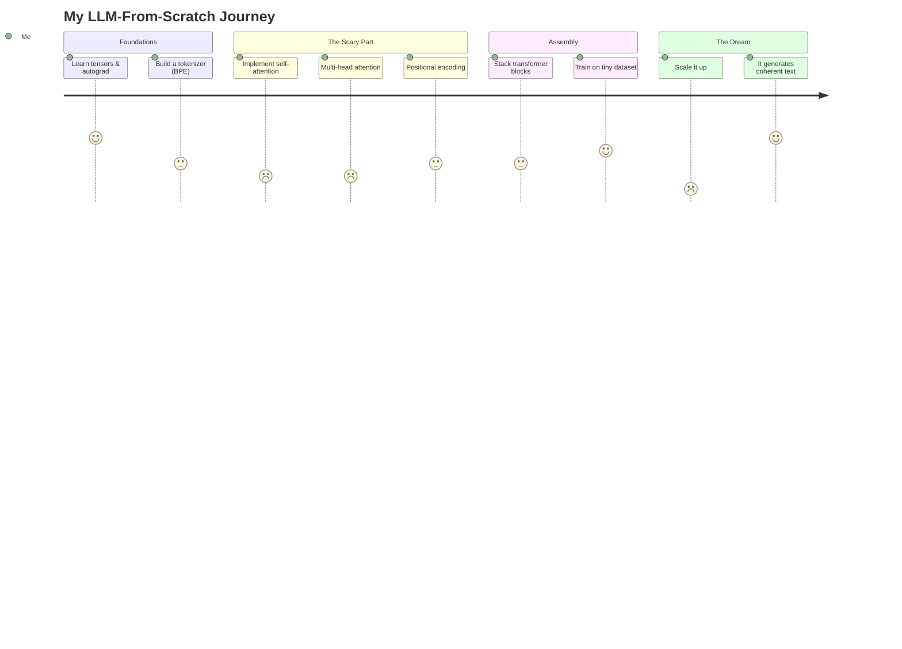

 

  

---

## 🧸 What is this?

A hands-on, no-shortcuts journey to **understand LLMs by building one from the ground up** — tokenizer, embeddings, attention, transformer blocks, training loop, and (eventually) something that talks back without embarrassing me.

This repo is both a **learning log** and a **working codebase**. Expect messy commits, "wait it actually works??" moments, and a lot of `print(tensor.shape)`.

---

## 🗺️ The Quest Map

---

## 🎯 Progress Tracker

| Milestone | Status |
|---|---|
| 🧮 Tensors, autograd, backprop from scratch | ✅ Done |
| ✂️ Byte-Pair Encoding tokenizer | ✅ Done |
| 🔡 Embedding + positional encoding | ✅ Done  |
| 👀 Self-attention (single head) | 🚧 In progress |
| 🧠 Multi-head attention | 🚧 In progress |
| 🏗️ Full transformer block | ⬜ Not started |
| 🔁 Training loop + loss tracking | ⬜ Not started |
| 💬 Text generation / sampling | ⬜ Not started |
| 🚀 "It kind of sounds smart" | ⬜ The dream |

---

## 🧰 Tech Stack

---

## 🐣 Why build from scratch instead of using HuggingFace?

Because reading about attention ≠ understanding attention until you've debugged a shape mismatch at 1am and screamed into a pillow. This repo is proof I did the reps.

---

## 🤝 Follow Along

If you're also learning LLMs the hard way, feel free to:
- ⭐ star this repo for moral support
- 🍴 fork it and break it in your own creative ways
- 🐛 open an issue if you spot a bug (there are several, I know)
- 💬 drop a discussion if you want to nerd out about attention mechanisms

  

